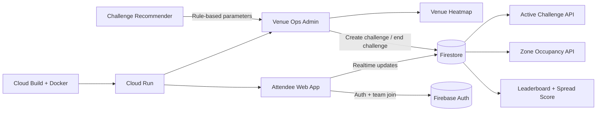

# PULSE -- Crowd Coordination Through Collective Play

> Sports & Entertainment vertical -- Smart Venue Operations

[Cloud Run URL](https://pulse-48556507973.asia-south1.run.app/) | [GitHub Repo](https://github.com/Chirag8405/Pulse)

## Chosen Vertical
Sports & Entertainment. PULSE is designed for large-scale sporting venues (10,000-80,000 attendees)
to reduce crowd congestion during live events through collective behavioral coordination.

## Approach and Logic
Most venue crowding systems fail for one reason: they treat people like traffic. During a live match, attendees do not respond to generic "please move" announcements because those messages have no personal incentive. This is the whistle problem: everyone hears the same instruction, but each individual chooses to wait for others to move first, so congestion persists.

PULSE changes that incentive structure by turning redistribution into collective play. Every attendee is assigned to a team and receives live challenge goals tied to real venue zones. Movement is no longer framed as compliance; it is framed as contribution. Participants can see their team's spread score update in real-time, which creates immediate social feedback and a clear reason to act now rather than later.

For venue operators, this converts a behavior-management problem into a game loop with measurable outcomes. The system encourages voluntary movement, lowers pressure at bottlenecks, and produces a live operational view that can be acted on quickly.

The smart assistant component (Challenge Recommender) uses rule-based decision logic:
- Analyzes current zone occupancy across 8 venue zones
- Reviews team performance history (last 5 challenges)
- Considers event timing (early game / mid-game / halftime / late)
- Outputs: recommended target zones, spread percentage, duration, and human-readable reasoning

## How the Solution Works

Step by step:
1. Attendee scans in at venue entry -> assigned to a team based on seating section
2. Venue ops creates a challenge (manually or using AI Recommender suggestions)
3. Challenge is broadcast to all teams in real-time via Firestore listeners
4. Teams see their spread score update as members move to different venue zones
5. First team to reach the target spread percentage wins the reward
6. Venue ops sees real-time heatmap of crowd distribution

## Assumptions Made
- Venue has stable internet coverage throughout (WiFi or 4G)
- Attendees are willing to share approximate location (zone-level, not GPS precision)
- Each attendee has a smartphone with a modern browser
- Seating section can be mapped to a team (simple regex matching)
- 'Wankhede Stadium, Mumbai' is used as the demo venue
- The smart recommender uses rule-based logic (not ML) given hackathon time constraints
- Rewards are experiential (no monetary value) -- venue must honor them manually

## Tech Stack
| Layer | Technology |
|---|---|
| Framework | Next.js 16 (App Router) |
| Language | TypeScript |
| Database | Firebase Firestore |
| Auth | Firebase Authentication (Google + Anonymous) |
| Maps | Google Maps Platform + Visualization |
| Deployment | Docker + Google Cloud Run + Cloud Build |

## Local Setup
1. Clone the repository.
2. Install dependencies: `pnpm install`
3. Copy env template: `cp .env.example .env.local`
4. Add Firebase and Google Maps credentials to `.env.local`
5. Start development server: `pnpm dev`

## Running Tests
`pnpm test` -- unit and component tests
`pnpm test:coverage` -- with coverage report
`pnpm test:e2e` -- Playwright E2E (requires running dev server)

## Deployment (Cloud Run)
1. Authenticate and set project:
   `gcloud auth login`
   `gcloud config set project YOUR_PROJECT_ID`
2. Enable required services:
   `gcloud services enable run.googleapis.com cloudbuild.googleapis.com artifactregistry.googleapis.com secretmanager.googleapis.com`
3. Create required secret (example):
   `echo -n "YOUR_FIREBASE_API_KEY" | gcloud secrets create firebase-api-key --data-file=-`
4. Build and deploy with Cloud Build pipeline:
   `gcloud builds submit --config cloudbuild.yaml .`
5. Direct deploy (alternative):
   `./scripts/deploy.sh`
6. Fetch service URL:
   `gcloud run services describe pulse --region asia-south1 --format='value(status.url)'`

## Google Services Used
| Service | How It's Used |
|---|---|
| Firebase Authentication | Google Sign-In + Anonymous auth |
| Firebase Firestore | Real-time challenge data, team locations, leaderboard |
| Firebase Analytics | Event tracking (challenge created/completed, event started) |
| Google Maps Platform | Satellite heatmap of crowd density across venue zones |
| Google Cloud Run | Production deployment (asia-south1) |
| Google Cloud Build | CI/CD pipeline: test -> build -> deploy |

## License
MIT

## Final Pre-Submission Checklist
- [ ] pnpm build -- zero errors, zero TypeScript errors
- [ ] pnpm test:coverage -- passes with > 70% coverage
- [ ] docker build -t pulse . -- builds successfully, image < 200MB
- [ ] curl http://localhost:3000/api/health -- returns { status: 'ok' }
- [ ] All pages load on mobile (375px) with no horizontal scroll
- [ ] Dark mode: every page tested
- [ ] Neobrutalism: every card has 2px border + hard shadow
- [ ] No console.log in production paths
- [ ] No hardcoded API keys anywhere (grep -r 'AIzaSy' src/)
- [ ] README has all 4 required sections (vertical, approach, how it works, assumptions)
- [ ] GitHub repository is PUBLIC
- [ ] All work is on main branch (not a feature branch)
- [ ] Regular commits throughout (not one giant commit)
